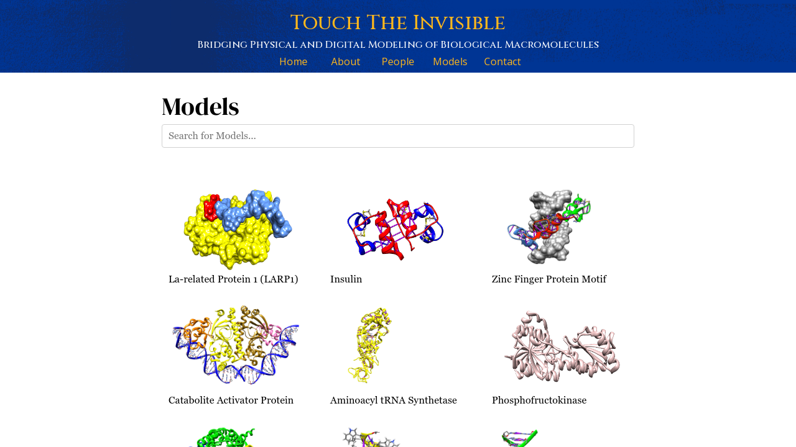
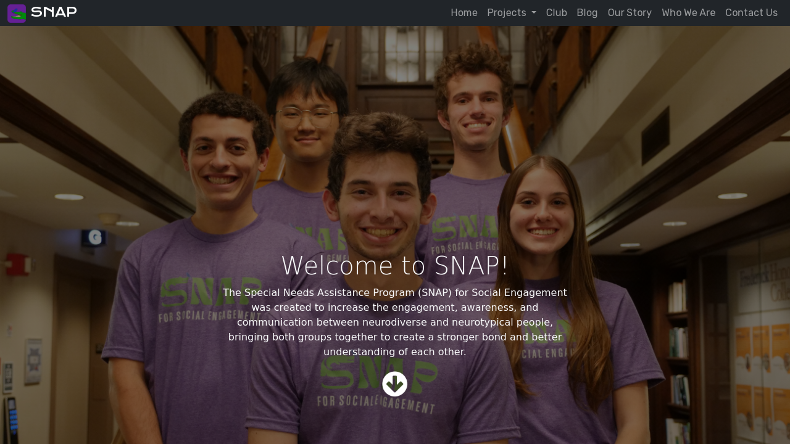
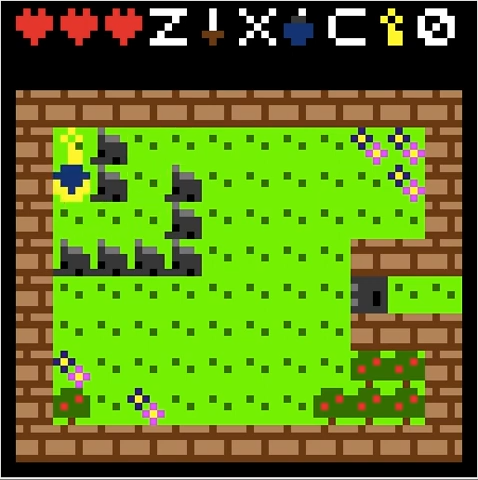

## TouchTheInvisible
  

    
    
Click image to view larger version

    

      <button type="button" class="btn btn-primary text-light" href="https://touchtheinvisible.com/">Website</button>
      <button type="button" class="btn btn-primary text-light" href="https://github.com/TouchTheInvisible/touchtheinvisible.github.io/">GitHub</button>
    

  

  

Visualizing macromolecular systems cam help students better understand the basic principles governing cell function (from storage of genetic information, to production of cellular components). In this project, we combine the crystallography data with 3D-printing technology to build scientifically accurate models of molecular complexes and use them in undergraduate biology and biochemistry courses. Through classroom applications we engage students in multisensorial learning experience at deep cognitive and perceptual levels that other types of molecular visualizations do not provide. When holding a molecular complex in your hand, you can study the 3D-shape from different angles, find the functional groups enabling specific intra and inter molecular binding, or examine grooves and crevices allowing the structural domains to combine in a macromolecular structure.
  

## Special Needs Assistance Program
  

    
    
Click image to view larger version

    

      <button type="button" class="btn btn-primary text-light" href="https://snapfse.com/">Website</button>
    

  

  

SNAP is a pittsburg-based organization which focuses on promoting engagement, awareness, and communication between neurodiverse and neurotypical communities. It maintains a presence as a student run organization at the University of Pittsburgh where it runs various community focused programs alongside its many partners (including [UPMC](https://www.upmc.com/)). SNAP also has a research wing which focuses on utilizing new technology to help facilitate effective and equitable communication between neurodiverse and neurotypical individuals. As a founding member, I serve on the advisory board, design and maintain the website for the organization.
  

## Assembly-based Adventure Game
  

    
    
Click image to view larger version

    

    <button type="button" class="btn btn-primary text-light" data-bs-toggle="popover" data-bs-content="Top popover">
  GitHub
  </button>
    

  

  

As a 2D adventure game, made in the style of the old *Legend of Zelda* games, this project was written entirely in [MIPS assembly](https://en.wikipedia.org/wiki/MIPS_architecture) and designed to run on the [MARS assembler](http://courses.missouristate.edu/kenvollmar/mars/). The game implements everything from an various weapons, to enemy AI, to scoring. Source available upon request.
  

