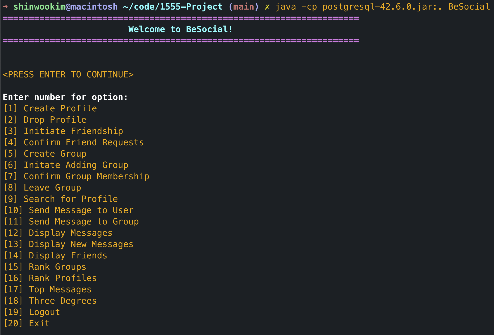

BeSocial is a Social Networking System for the University of Pittsburgh which uses a PostgreSQL database as the backend and Java (using JDBC) as the front end. This app uses SQL functions and triggers for all major functionalities. The Java front end is purely used to provide an optimized interface for the user.

## Supported Features
- **Creating and Removing Profiles**
  - Automatically generates user IDs of new accounts
  - Automatically removes users from friend relations and groups when accounts are deleted
  - Automatically removes user messages when accounts are deleted 
- **Login/Logout**
  - Logs in as the user when a valid information is provided
  - Automatically updates the last login time
- **Manage Friends**
  - Supports making and accepting friend requests
  - Supports displaying friends
- **Manage Groups**
  - Supports making join request for groups
  - Supports leaving groups
  - Supports confirming group memberships (as group manager)
- **Send and Recieve Messages**
  - Supports for direct and group messages
- **Miscellaneous**
  - Supports searching for profile given a string query (for name, email, etc.)
  - Supports ranking groups based on the number of members
  - Supports ranking user profiles based on the number of friends
  - Supports ranking user profiles based on the number of messages
  - Supports *Three Degrees* — calculating a path from a user to another with at most 3 hops between them

**Code Available Upon Request**
{: .text-center}