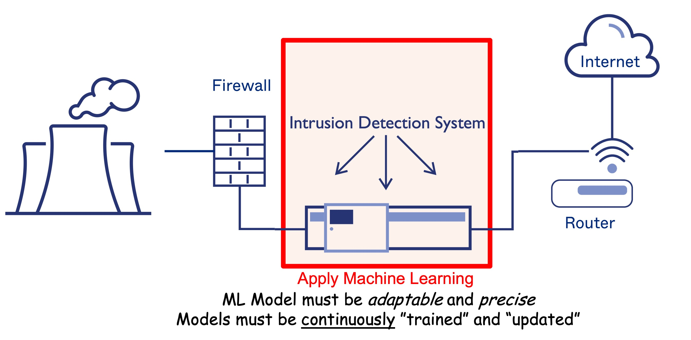

This project aims to adapt [GRASP](https://en.wikipedia.org/wiki/Greedy_randomized_adaptive_search_procedure) (Greedy Randomized Adaptive Search Procedure) in optimizing hyperparameter that are used to train machine learning models in the context of Intrusion Detection Systems (IDS).

## Background 

This project is built on top of [existing work](https://ieeexplore.ieee.org/document/9452077)[^1] by *S. E. Quincozes, et al.* which used a GRASP-based technique for feature selection in electric substation's instrusion detection systems which utilize machine learning algorithms.

|  |
| :----------------------------------------------------------------------------------------------------------------------------------------: |
|                                             Practical Application of Machine Learning in IDSs                                              |

[^1]: S. E. Quincozes, D. Mossé, D. Passos, C. Albuquerque, L. S. Ochi and V. F. dos Santos, "*On the Performance of GRASP-Based Feature Selection for CPS Intrusion Detection*," in IEEE Transactions on Network and Service Management, vol. 19, no. 1, pp. 614-626, March 2022, doi: 10.1109/TNSM.2021.3088763.

This project was developed a part of the CS 1980 Capstone course at the [University of Pittsburgh](https://pitt.edu). The main contributors are: **Shinwoo Kim**, **Enoch Li**, **Jack Bellamy**, **Zi Han Ding**, **Zane Kissel**, **Gabriel Otsuka**.

This project was sponsored and directed by **Dr. Daniel Mossé**[^mosse] and **Dr. Silvio E. Quincozes**[^quincozes].

[**GitHub**](https://github.com/shinwookim/GRASP-HPO){: .btn target="_blank"}
{: .text-center}

---

[^mosse]: Professor of Computer Science, [University of Pittsburgh](https://cs.pitt.edu), USA

[^quincozes]: Professor, Federal University of Pampa [[UNIPAMPA]](https://unipampa.edu.br), Brazil