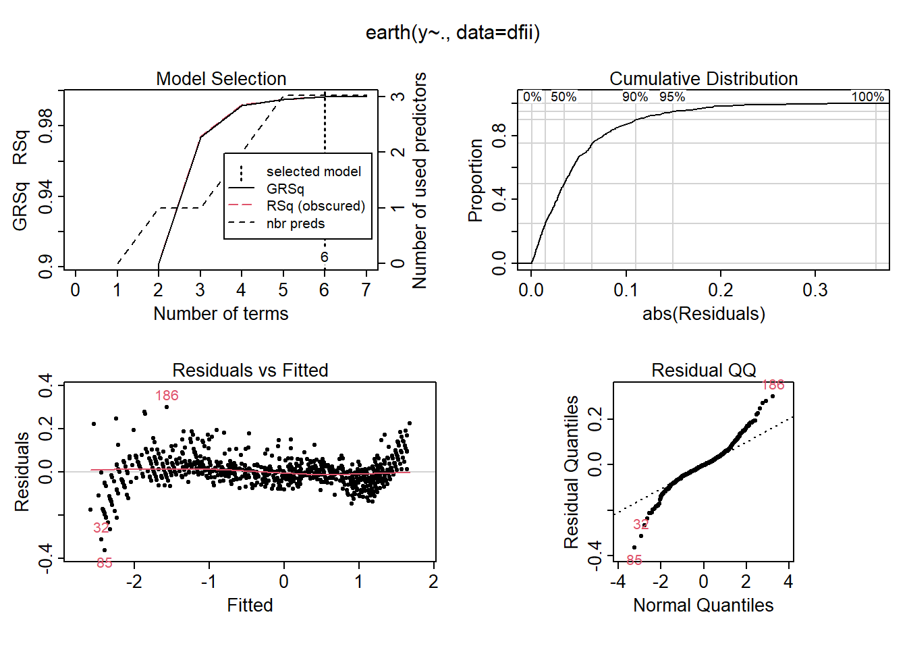
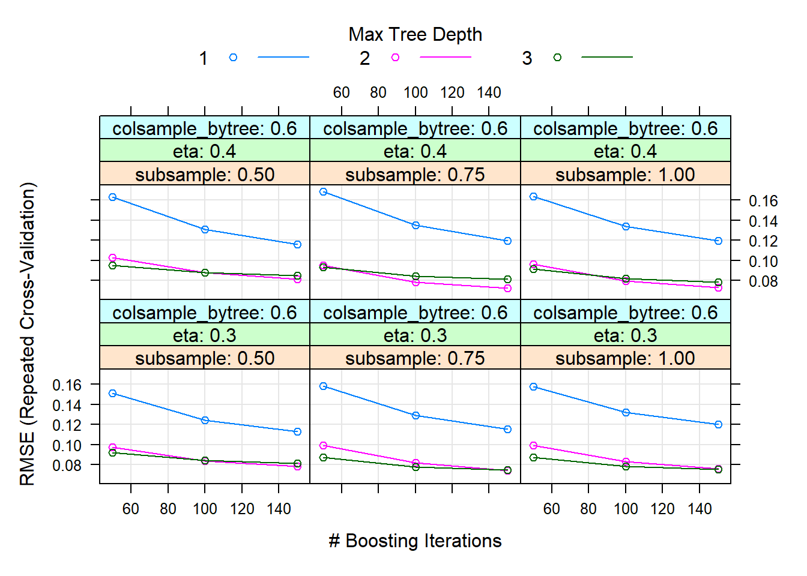
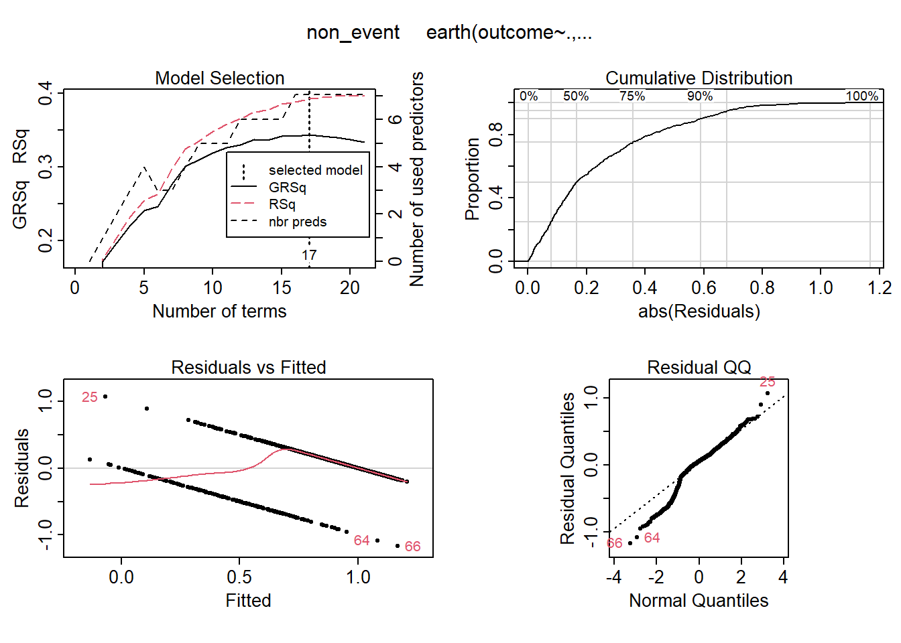
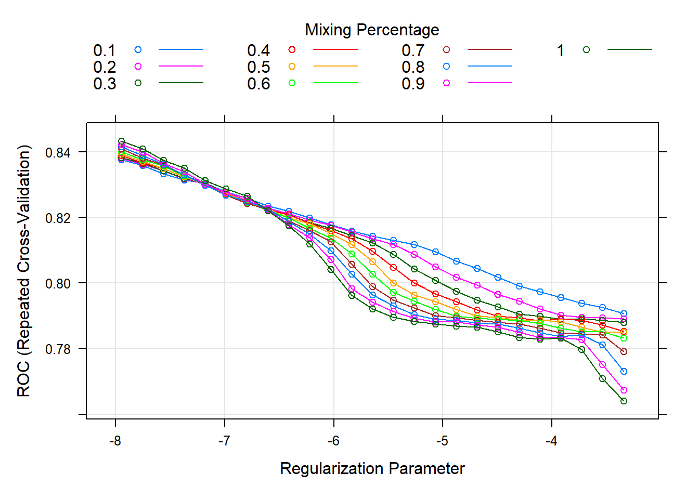

This comprehensive project used various machine learning methods—from simple linear regression to support vector machines and random forest—on a moderate-size paint detail dataset provided by [PPG Industries, Inc](https://www.ppg.com/en-US).

## Abstract

Although it is sometimes difficult distinguish between the variety of paint colors with the human eye, each shade of paint has various properties which can be quantified and analyzed. For a company like [PPG](https://www.ppg.com/), the largest coatings company in the world, it is very important to study their library of paint colors for these properties as slight modifications may result in a significant change in their sales.

In this analysis, we aim to use machine learning techniques to learn patterns associated with PPG's top selling paint colors. We have been provided with the [RGB](https://en.wikipedia.org/wiki/RGB_color_model) and [HSL](https://en.wikipedia.org/wiki/HSL_and_HSV) color data (to be used as inputs) and two output variables (denoted `response` and `outcome`) of PPG's top selling paint colors. The `response` is a continuous output associated with an important paint property and the `outcome` is a binary output associated with the popularity of the paint.

Our analysis will take two main approaches:

1.  **Regression**: We will train models to predict the important paint property, `response`, as a function of the color model inputs.
2.  **Classification**: We will train models to classify if the paint is among the popular paint products sold by PPG based just on color models inputs.

In this sense, we will use the following tools, technologies, and techniques:
- `R` programming language with the `Tidyverse` package, `Caret` package, and many other libraries specific to different parts of project
- Simple Linear Regression (with and without basis functions), Logistic Regression, Generalized Linear Regression, Regularized Regression with Elastic net, Random Forest, Gradient Boosted Tree, Support Vector Machines, and Multivariate Additive Regression Splines (MARS).

Throughout our analysis, we will attempt to answer relevant question such as:
- "*Are the inputs from one color model more influential on predicting the important paint property*", 
- "*Are the inputs from one color model more influential on the probability the paint is popular?*"

<strong>Project Details Available Upon Request</strong> 
(Report cannot be made public as it contains data proprietary to PPG Industries Inc.)

## Sample Visualizations

|  |  |
| :--------------------------------------------------------------------------------------------------------------------------: | :-----------------------------------------------------------------------------------------------: |
|                                       Multivariate Additive Regression Splines Result                                        |                                       XGBoost Model Result                                        |

|  |  |
| :--------------------------------------------------------------------------------------------: | :------------------------------------------------------------------------------------------------: |
|                                       Classifier Result                                        |                                       Regularization Result                                        |

