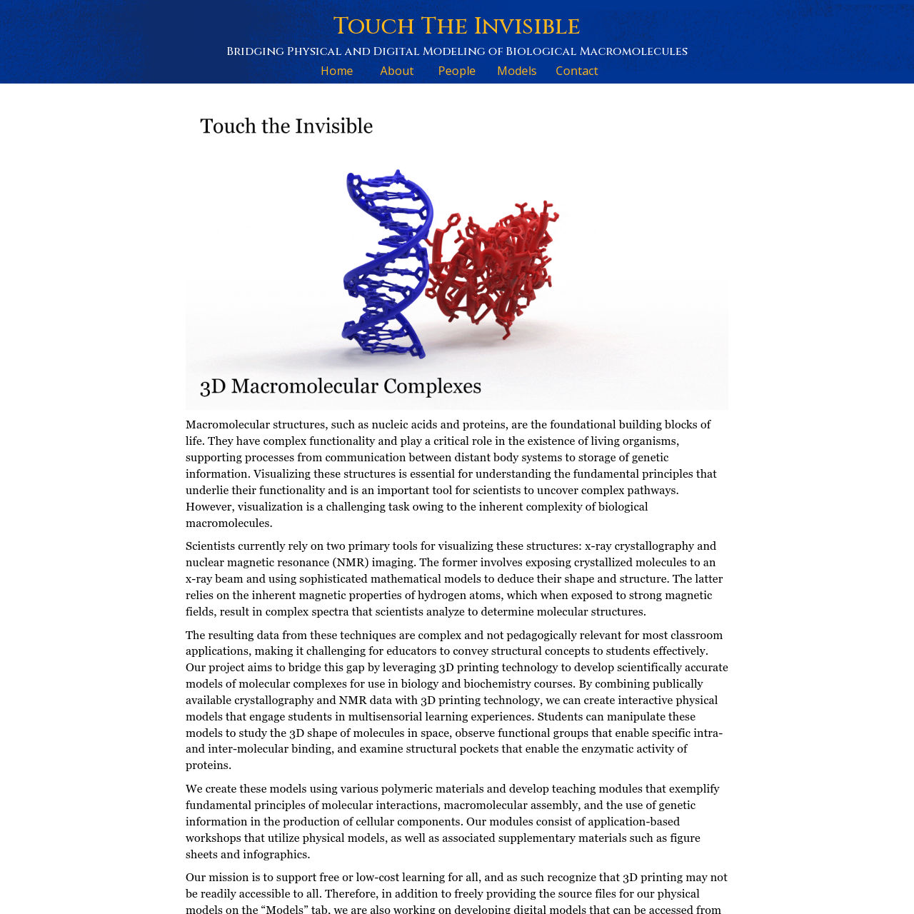

It is well known that visualizing macromolecular systems can help students in the classroom better understand the basic principles governing cell function (from storage of genetic information, to production of cellular components).

In this project, we combine the crystallography data with 3D-printing technology to build scientifically accurate models of molecular complexes and use them in undergraduate biology and biochemistry courses. Furthermore, we provide an interactive web application where students can easily access and manipulate the various 3D models for the macromolecular models.

|  |
| :----------------------------------------------------------------------------------------------------------------: |
|                                    Screenshot of Touch The Invisible's Website                                     |

[**Launch TouchTheInvisible**](https://touchtheinvisible.com/){: .btn target="_blank"}
{: .text-center}
