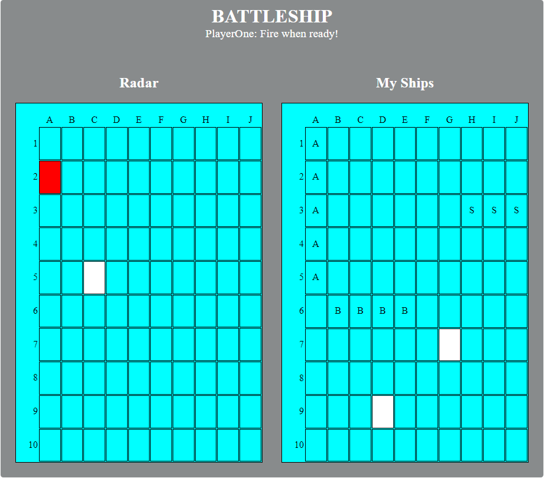
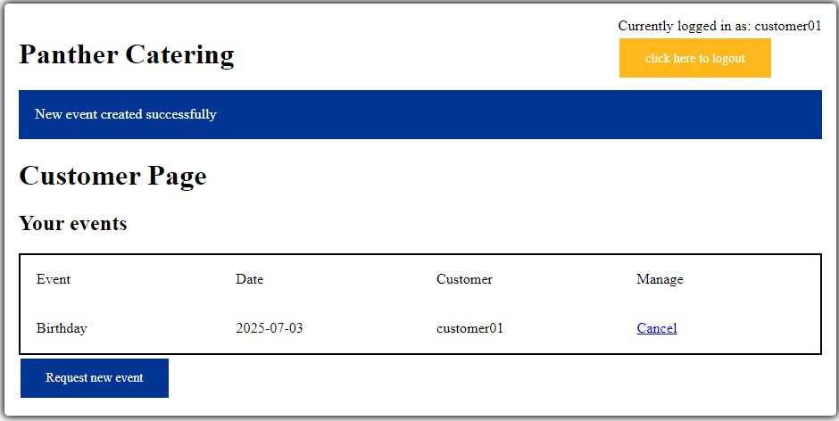
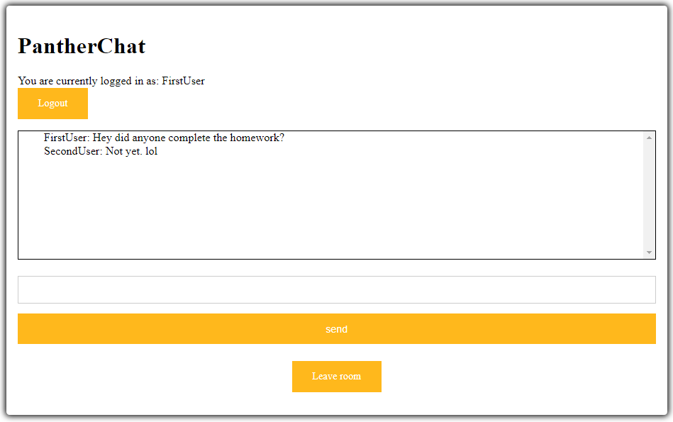
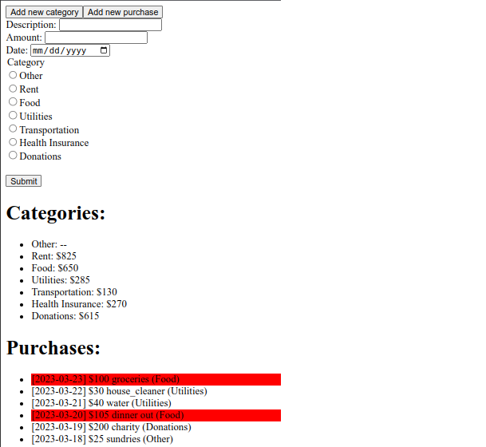

Below are some of my projects for the CS 1520: Programming Languages for Web Applications course that I took in Spring 2022 with Dr. Nicholas Farnan.

## BattleShip
Battleship is a strategy type guessing game for two players. The game dates back to World War I and was traditionally played as a *pencil-and-paper game*. In the 1960s, American board game manufacturer, Milton Bradley, released a plastic version to wide success.[^1] 

This app is a recreation of that classic board game with rules identical to the original (ten-by-ten grids with 3 types of game pieces). The game supports full [*hotseat multiplayer mode*](https://en.wikipedia.org/wiki/Hotseat_(multiplayer_mode)) with each player passing the computer back-and-forth.

|  |
| :--------------------------------------------------------------------------------------------------------------: |
|                                                                                                                  |

The entire game logic is written in vanilla JavaScript using only traditional DOM manipulation. As such, there are no dependencies or reliance on outside libraries. Similarly, the entire styling is done using manually written HTML and CSS.

[^1]: [https://en.wikipedia.org/wiki/Battleship_(game)](https://en.wikipedia.org/wiki/Battleship_(game))

## Panther Catering
PantherCatering is a web application that is designed to help manage a catering company. The application supports a full featured login system (for the owner, employees, and customers) and provides an interface where:
1. customers can request events on given days (and cancel previous requests)
2. employees can sign up to work on certain events, and
3. give the owner a rundown of what events are scheduled and which employees are staffed for the particular events.

|  |
| :------------------------------------------------------------------------------------------------------------------------: |
|                                                                                                                            |

The application is backed by an SQLite database and is served server-side using Python's Flask framework.

## PantherChat
PantherChat is a web application that hosts and manages chat rooms. The application supports a full featured login system, multi-user chatrooms, and AJAX/JSON-polling. The application is backed by an SQLite database and is served server-side using Python's Flask framework.

|  |
| :--------------------------------------------------------------------------------------------------------------------: |
|                                                                                                                        |

## PantherBudget
PantherBudget is a very simple budget application for a single user. The application supports storing:
- several budget categories with a set monthly limit for each category (e.g., \\$825 for rent, \\$400 for groceries, \\$130 for gas, etc.)
- purchases with associated date and price (with purchases that are over the budget for the month highlighted in red)

The backend is implemented in Python Flask with SQLite as the underlying database. This backend can be accessed via a RESTful API using the standard HTTP methods.

|  |
| :--------------------------------------------------------------------------------------------------------------------------: |
|                                                                                                                              |

The frontend is implemented in REACT and uses AJAX to interact with the Flask backend.