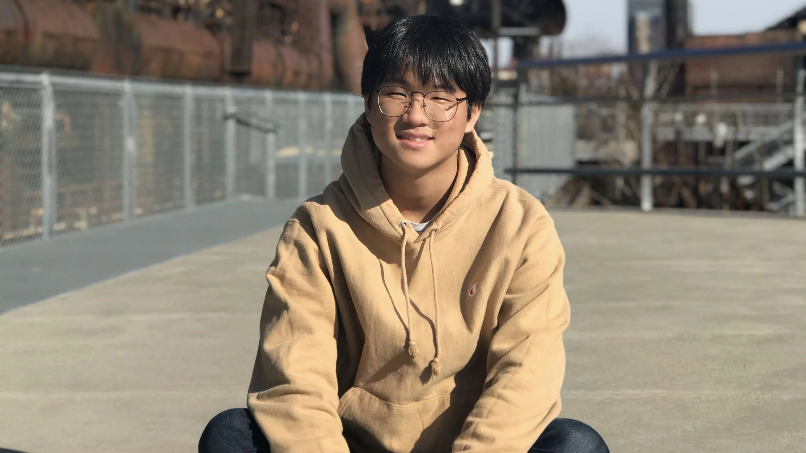

{: .figure-img .img-fluid .rounded}

  <a class="btn btn-outline-dark" href="{{ '/about/' | prepend: site.baseurl }}">About Me</a>
  <a class="btn btn-outline-dark" href="{{ '/resume/' | prepend: site.baseurl }}">Résumé</a>
  <a class="btn btn-outline-dark" href="{{ '/teaching/' | prepend: site.baseurl }}">Courses I'm Teaching</a>
  <a class="btn btn-outline-dark" href="{{ '/contact/' | prepend: site.baseurl }}">Contact Me</a>

<!--

    <a class="btn btn-outline-dark" href="{{ '/background/' | prepend: site.baseurl }}">About Me</a>
	<a class="btn btn-outline-dark" href="{{ '/resume/' | prepend: site.baseurl }}">Résumé</a>
    <a class="btn btn-outline-dark" href="{{ '/teaching/' | prepend: site.baseurl }}">Courses I've Taught</a>

-->
