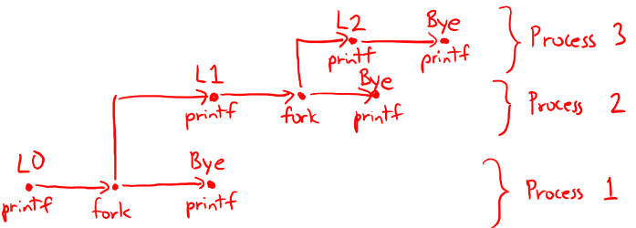

<style>
    .mermaid{
        width: 160%;
        max-width: 160%;
    }
</style>

## Question 1: Dynamic Memory
We use dynamic memory because:
- **A.** The heap is significantly faster than the stack
- **B.** Storing data on the stack requires knowing the size of that data at compile time
- **C.** The stack is prone to corruption from buffer overflows
- **D.** None of the above

<div class="row">
<div class="col-3" markdown ="1">
### Student Responses
- A : 18%
- B : 53%
- C : 24%
- D : 6%
</div>
<div class="col-9" markdown ="1">
### Solutions
- A: Recall that to allocate some space in the stack, all that was needed was to move the stack pointer (`%rsp`) using a simple `sub` instruction. For dynamic memory allocation (such as `malloc()`), we needed a more elaborate and complicated scheme such as the ones you implemented in *project 2*. Hence, stack allocation (or static memory allocation) is significantly faster than the heap (dynamic memory allocation) and thus this answer is incorrect.
- **B: This is the correct answer.** One of our motivations for using dynamic memory allocation was that we did not know ahead of time how much memory our program would need. Indeed, for the queue lab, since we didn't know how many '*nodes*' would be added to our queue, we needed to call `malloc()` as many times as was needed.
- C: Although the stack is prone to corruption (as you saw in *project 3*), this is not why we use dynamic memory allocation. Much of the security issues with stack allocation can be overcome by methods such as *stack canaries* or *Address space layout randomization*.
- D: This is incorrect since **B** is the correct answer.
</div>
</div>

---

## Question 2: The `wait()` System Call
Do parent processes wait for grandchildren processes?
<div class="row">
<div class="col-3" markdown ="1">
### Student Responses
- True : 6%
- False : 94%
</div>
<div class="col-9" markdown ="1">
### Solutions
If the parent process forks, and the child process forks again, the original parent process, on `wait()` will not wait for the grandchildren process. Hence, the solution is **false**.
</div>
</div>

---

## Question 3: Tracing through `fork()`s
Given the following code, is the following sequence of output possible?
<div class="row">
<div class="col" markdown ="1">
```c
void nestedfork() {
    printf("L0\n");
    if (fork() == 0) {
        printf("L1\n");
        if (fork() == 0) {
            printf("L2\n");
        }
    }
    printf("Bye\n");
}
```
</div>
<div class="col" markdown ="1">
```
Sequence 1:
L0
L1
Bye
Bye
Bye
L2
```
</div>
</div>

<div class="row">
<div class="col-3" markdown ="1">
### Student Responses
- True : 6%
- False : 94%
</div>
<div class="col-9" markdown ="1">
### Solutions
Drawing a process graphs to model forks, tells us that the output `L2` cannot come after three `Bye`s. Hence, the answer is **false**.

</div>
</div>
