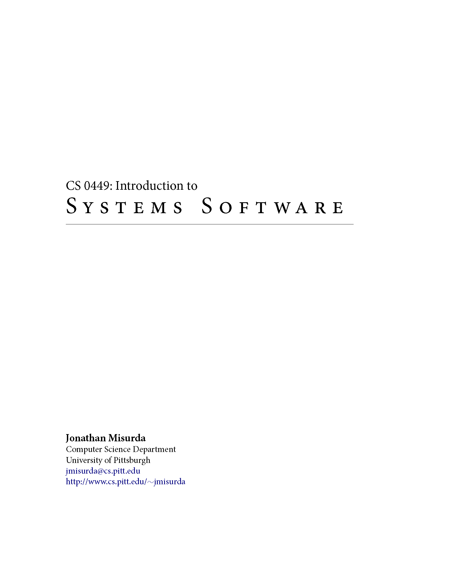

The official text for this course is Bryant & O’Hallaron's [_Computer Systems: A Programmer's Perspective (3rd Edition)_](http://csapp.cs.cmu.edu/3e/home.html). It provides great explanations and various practice problems on the topics we cover in this course; the chapter on dynamic memory management is particularly well-written. Students enrolled in CS 0449 have access to this book as part of [RedShelf's](https://www.redshelf.com/) inclusive access which can be accessed through [Canvas](canvas.pitt.edu).
<!--  -->

In addition to our official text, you may find it beneficial to check out some other books which are available for free (below) which take on a slightly different approach:

## Excellent free textbooks covering selected topics:

    

    
<a href="https://people.cs.pitt.edu/~jmisurda/teaching/cs449/cs449_latest.pdf">CS 0449: Introduction to Systems Software</a>

    
Jonathan Misurda

    
This book is compilation of lecture notes based on a previous iteration of this course (which had a slightly different curriculum). Although some topics are more/less emphasized than what we will discuss in lecture, it is still a great resource with superb explanations.

    

    
<a href="https://diveintosystems.org/book/">Dive into Systems</a>

    
Suzanne J. Matthews, Tia Newhall, and Kevin C. Webb. (Licensed <a href="https://creativecommons.org/licenses/by-nc-nd/4.0/">CC BY-NC-ND 4.0.</a>)

    
Dive into Systems is a free, online textbook that serves as a gentle introduction to computer systems, computer organization, and parallel computing.

